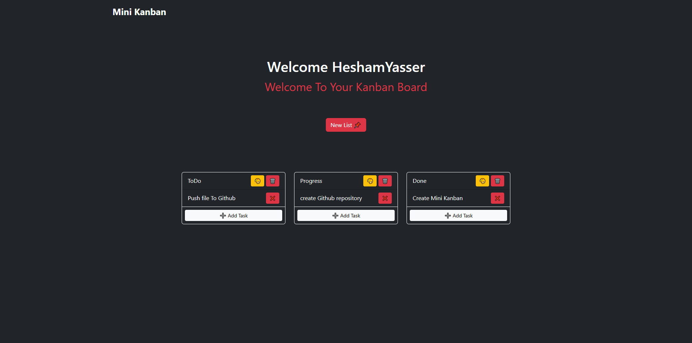

# 📌 Task Manager

A simple task manager using **JavaScript, LocalStorage, and SweetAlert2**, allowing users to create task lists, add tasks, delete them, change list colors, and reorder tasks between lists with **drag & drop support**.

---

## 🚀 Features

✅ **Create lists** with a default black background.\
✅ **Add tasks** inside lists.\
✅ **Delete tasks** or entire lists.\
✅ **Drag & drop tasks** between lists (order is saved).\
✅ **Change background color** of lists dynamically.\
✅ **Persistent storage** with LocalStorage.

---

## 📂 Installation & Usage

1. **Clone the repository:**

```sh
git clone https://github.com/HaSh3003/Mini-Kanban
cd YOUR_REPO
```

2. **Open the project:**
   - Just open `index.html` in a browser. No server required! 🎉

---

## 🛠️ Code Example

Here's an example of how tasks are stored in **LocalStorage**:

```js
let ListArray = JSON.parse(localStorage.getItem("list")) || [];
ListArray.push({ title: "New List", tasks: ["First Task"] });
localStorage.setItem("list", JSON.stringify(ListArray));
```

Tasks are **draggable between lists**, and positions are **saved automatically** using **SortableJS**.

---

## 📷 Screenshots



---

## 📜 License

This project is **open-source**. Feel free to modify and use it!

---

## 🤝 Contributing

Want to improve it? **Fork the repo, make changes, and submit a pull request!** 🚀

---

## 📧 Contact

If you have any questions, feel free to reach out!

📩 Email: [perfecto.dev@programmer.net](mailto:perfecto.dev@programmer.net)\
🐦 Twitter: [@HaSh_Perfecto](https://x.com/HaSh_Perfecto)\
💻 GitHub: [HaSh3003](https://github.com/HaSh3003)
